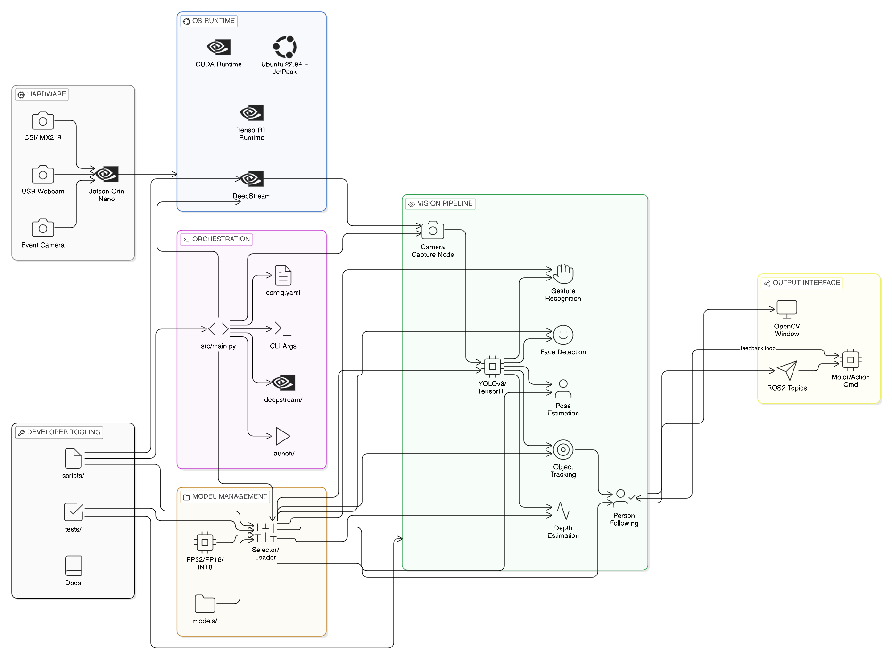
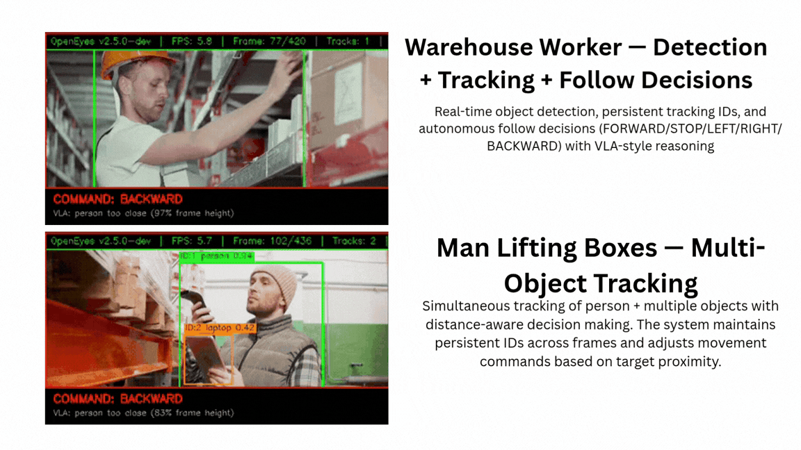
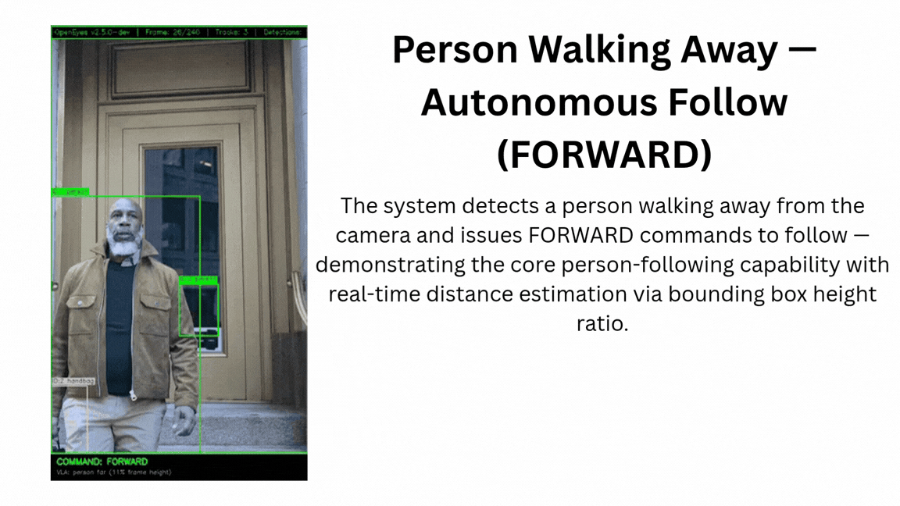

# OpenEyes

**v2.5.0-dev** · 🤖 Hardware-Agnostic Edge Vision Framework with World Models

[](https://github.com/mandarwagh9/openeyes)
[](LICENSE)
[](https://github.com/mandarwagh9/openeyes/actions)
[](https://www.python.org/)

---

## What is OpenEyes?

OpenEyes is an open-source, hardware-agnostic robot vision framework for edge AI. It runs on **NVIDIA Jetson**, **Raspberry Pi**, **Intel NPU**, **Hailo**, and **Qualcomm** platforms — with world models for predictive intelligence.

A robot needs to see, predict, and plan — not just react. OpenEyes delivers the full pipeline: detection → tracking → depth → prediction → planning — all on edge hardware.

---

## ✨ Features

| Capability | Description |
|:-----------|:------------|
| 🔍 **Object Detection** | YOLO11n/12n/26n with TensorRT optimization (35-40 FPS) |
| 📏 **Depth Estimation** | MiDaS + Depth Anything V3 (35.7% better than MiDaS) |
| 👤 **Face Detection** | MediaPipe FaceMesh (optimized: complexity=0) |
| 👋 **Gesture Recognition** | MediaPipe Hands (optimized: max_hands=1) |
| 🦴 **Pose Estimation** | MediaPipe Pose (optimized: complexity=0) |
| 🎯 **Object Tracking** | ByteTrack with occlusion handling via world models |
| 🚶 **Person Following** | Autonomous person tracking with predictive following |
| 🧠 **World Models** | LeWM (15M) for 100-200 Hz predictive planning |
| 🔮 **V-JEPA 2** | Spatiotemporal features for perception enhancement |
| 🛡️ **Safety** | Predictive collision avoidance, E-STOP, health monitoring |
| 📡 **ROS2** | Full integration with 7+ topics |
| 🚀 **Fleet Management** | Multi-device deployment with OTA updates |
| 🏭 **Industry Templates** | Warehouse, Manufacturing, Agriculture, Retail |
| 🐳 **Docker** | Production-ready containerized deployment |

---

## 🏗️ Architecture



```
┌─────────────────────────────────────────────────────────────┐
│                    OpenEyes v2.5.0 Pipeline                  │
│                                                              │
│  Camera → Detection → Tracking → Depth → [World Model]      │
│                                              ↓               │
│                                    Predictive Planning       │
│                                    Safety Evaluation         │
│                                    Occlusion Handling        │
│                                                              │
│  Hardware Abstraction Layer                                  │
│  TensorRT │ OpenVINO │ TVM │ Hailo │ QNN │ ONNXRuntime       │
│                                                              │
│  Platforms: Jetson Orin │ Pi 5 │ Intel NPU │ Hailo │ Qualcomm│
└─────────────────────────────────────────────────────────────┘
```

---

## 🚀 Quick Start

### 1. Install

```bash
git clone https://github.com/mandarwagh9/openeyes
cd openeyes
pip install -r requirements.txt
```

### 2. Run

```bash
# Basic vision pipeline
python -m src.main --camera 0 --debug

# With person following
python -m src.main --camera 0 --follow --debug

# With world model (predictive tracking)
python -m src.main --camera 0 --world-model lewm --follow --debug

# Turbo mode for maximum FPS
python -m src.main --camera 0 --world-model lewm --follow --turbo --debug

# Industry template (warehouse)
python -m src.main --camera 0 --template warehouse --debug
```

### 3. Optimize (Jetson)

```bash
# One-command performance optimization
sudo bash scripts/jetson_perf.sh

# Expected: 8-12 FPS with full pipeline in turbo mode
```

---

## 📊 Performance

| Configuration | FPS (Orin Nano) | Notes |
|:--------------|:----------------|:------|
| Detection only (TensorRT) | 35-40 | YOLO11n FP16 |
| Full pipeline (default) | 4-6 | All models enabled |
| Full pipeline + turbo | 8-12 | Aggressive frame skipping |
| Minimal (--no-face --no-gesture --no-pose) | 15-20 | Detection + depth + tracking |
| World model (LeWM 15M) | 100-200 Hz | Planning only, <10ms |

---

## 🎬 Demos

### Demo 1



### Demo 2



### Run Demos Yourself

```bash
# Process any video through the pipeline
python demo/process_demo.py

# Or use the main pipeline with video input
python -m src.main --video path/to/video.mp4 --output output.mp4 --no-face --no-gesture --no-pose
```

---

## 🎮 CLI Reference

### Core Commands

| Flag | Description |
|:-----|:------------|
| `--camera N` | Camera source (default: 0) |
| `--debug` | Show annotated debug window |
| `--follow` | Enable person following |
| `--ros2` | Enable ROS2 publishing |
| `--model NAME` | Detection model (yolo11n, yolo12n, yolo26n) |
| `--list-models` | List available models |

### World Models

| Flag | Description |
|:-----|:------------|
| `--world-model TYPE` | World model (none, lewm, vjepa2) |
| `--plan-horizon N` | Planning horizon in steps (default: 10) |
| `--plan-samples N` | CEM sample count (default: 100) |
| `--prediction-fps N` | Prediction update rate (default: 30) |
| `--occlusion-frames N` | Max frames to predict through occlusion |
| `--safety-predict` | Enable predictive safety evaluation |

### Performance

| Flag | Description |
|:-----|:------------|
| `--turbo` | Aggressive frame skipping for max FPS |
| `--no-face` | Disable face detection |
| `--no-gesture` | Disable gesture recognition |
| `--no-pose` | Disable pose estimation |
| `--no-depth` | Disable depth estimation |
| `--no-tracking` | Disable object tracking |
| `--depth-model M` | Depth model (midas-small, da3-small, da3-base) |

### Industry Templates

| Flag | Description |
|:-----|:------------|
| `--template NAME` | Industry template (warehouse, manufacturing-qa, agriculture, retail) |

### Fleet Management

| Command | Description |
|:--------|:------------|
| `openeyes fleet register --name robot-01 --group warehouse` | Register device |
| `openeyes fleet list` | List all devices |
| `openeyes fleet deploy --model yolo26n --version v1.2 --group warehouse` | Deploy model |
| `openeyes fleet telemetry --device robot-01` | View device telemetry |

### Benchmarking

| Command | Description |
|:--------|:------------|
| `python -m benchmarks.run_benchmarks --all` | Benchmark all models |
| `python -m benchmarks.run_benchmarks --model yolo11n` | Benchmark specific model |
| `python -m benchmarks.run_benchmarks --report` | Generate JSON report |

---

## 🏭 Industry Templates

OpenEyes ships with pre-configured pipelines for the highest-demand industries:

| Template | Use Case | Key Features |
|:---------|:---------|:-------------|
| **warehouse** | Logistics, fulfillment | Package detection, pallet counting, forklift safety |
| **manufacturing-qa** | Quality assurance | Defect detection, PPE compliance, assembly verification |
| **agriculture** | Farming, crop monitoring | Weed detection, crop health, yield estimation |
| **retail** | Store analytics | Shelf monitoring, inventory counting, customer analytics |

```bash
# Start with warehouse template
python -m src.main --camera 0 --template warehouse --debug
```

---

## 🧠 World Models

OpenEyes integrates world models for **predictive intelligence** — going beyond reactive vision to anticipate and plan.

### LeWorldModel (15M params)
- Latent-space planning at **100-200 Hz**
- Predictive tracking through occlusions (5-10 frames)
- Safety evaluation before action execution
- Online learning from observation history
- Memory: <100MB, Power: 3-5W

### V-JEPA 2 (80M-600M params)
- Spatiotemporal feature extraction from video clips
- Enhances detection accuracy with temporal context
- ViT-B: 10-20 FPS, ViT-L: 3-6 FPS on Orin Nano

```bash
# Enable world model with predictive tracking
python -m src.main --camera 0 --world-model lewm --follow

# With safety evaluation
python -m src.main --camera 0 --world-model lewm --safety-predict
```

See [docs/WORLD_MODELS.md](docs/WORLD_MODELS.md) for complete documentation.

---

## 🖥️ Hardware Support

| Platform | TOPS | Power | Price | Backend |
|:---------|:-----|:------|:------|:--------|
| Jetson Orin Nano | 40 | 5-15W | $199-249 | TensorRT |
| Jetson Orin NX | 100 | 10-25W | $399-499 | TensorRT |
| Raspberry Pi 5 + AI HAT+ 2 | 40 | ~12W | ~$150 | Hailo DFC |
| Intel Core Ultra | 48 | 15-45W | $300-600 | OpenVINO |
| Hailo-8 | 26 | 3.5W | $150-200 | Hailo DFC |
| Qualcomm RB5/RB6 | 15-30 | 5-15W | $600-800 | QNN |

---

## 🐳 Production Deployment

### Docker

```bash
cd docker
docker compose up -d
```

### Systemd

```bash
sudo cp docker/openeyes.service /etc/systemd/system/
sudo systemctl enable openeyes
sudo systemctl start openeyes
```

---

## 📚 Documentation

| Document | Description |
|:---------|:------------|
| [QUICKSTART.md](QUICKSTART.md) | Getting started guide |
| [INSTALL.md](INSTALL.md) | Installation instructions |
| [COMMANDS.md](COMMANDS.md) | Complete CLI reference |
| [USER_GUIDE.md](USER_GUIDE.md) | User guide |
| [OPTIMIZATION.md](OPTIMIZATION.md) | Performance optimization |
| [TROUBLESHOOTING.md](TROUBLESHOOTING.md) | Common issues and solutions |
| [ROADMAP.md](ROADMAP.md) | Development roadmap |
| [CONTRIBUTING.md](CONTRIBUTING.md) | How to contribute |
| [docs/WORLD_MODELS.md](docs/WORLD_MODELS.md) | World models documentation |
| [docs/TECHNICAL_SPEC.md](docs/TECHNICAL_SPEC.md) | Technical specification |
| [WORLD_MODELS_PLAN.md](WORLD_MODELS_PLAN.md) | Implementation plan |
| [AGENTS.md](AGENTS.md) | Developer guidelines |

---

## 🧪 Testing

```bash
# Run all tests
pytest tests/ -v

# With coverage
pytest tests/ --cov=src --cov-report=html

# Current: 119 tests passing
```

---

## 📄 License

Apache 2.0 — see [LICENSE](LICENSE)

---

## 🙏 Acknowledgments

- **Ultralytics** — YOLO models
- **Meta FAIR** — V-JEPA 2, DINOv2, SAM 3
- **ByteDance** — Depth Anything V3
- **Hugging Face** — LeRobot, transformers
- **NVIDIA** — TensorRT, Jetson platform
- **MediaPipe** — Face, gesture, pose models
- **Mila/NYU** — LeWorldModel (arXiv:2603.19312)

---

## ⭐ Star History

[](https://www.star-history.com/#mandarwagh9/openeyes&Date)
